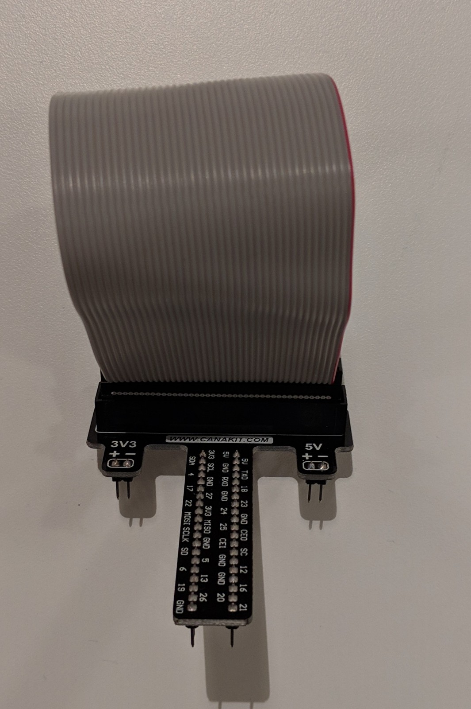

# Smart Compass
## Compass with Geo-Location functions and multi-user positioning 

This project aims to give a simple reliable solution to outdoor navigation for groups. The device uses coordinate points and bearing to guide the user to their destination. The device also gives users the position of friends with the same device in an area of 2km using a LoRa radios. The direction of the users and destination are indicated to the 8x8 sense-hat LED using points and arrows. The distance is also expressed using different colors for the points and arrows. This solution can be used anywhere in the world since it only relies on GPS satellites. 

***

 

## Demos

The code used for the demos can be found [here](https://gerrit.ericsson.se/#/admin/projects/MontrealGarage/smartCompass)

### GPS Demo
#### Description
For running the demo with GPS the goal is to set one of the devices with the current location of ericsson, this device stays inside the garage and is the one observed. The second device is taken outside around the building at different positions. This will result in the point on the observed compass changing position. The data will also be displayed on the web interface which shows the gps coordinates of the second device, its distance and bearing from the first devices coordinate points. This is to demonstrate to capability to show how you could find another person with the device.

#### Operation

To operate this demo you will need two devices setup with the [neccessary materials](#Materials). If the demo has been taken appart the [setup](#Setup) and [wiring](#wiring) sections will help you assemble to materials.

1. Power the compass attached with a GPS module, make sure a keyboard and monitor is connected to Raspberry Pi.
2. Navigate to the smart compass directory (~/Documents/smartCompass). In this directory you will find the python program `smartCompassGps.py`
3. Start the program using python3 with the command `python3 smartCompassGps.py`.
4. When the program begins you will be asked to set the compass pointing north and press enter. When standing in the Ericsson Garage north is the window. 
5. The program will then prompt you for your destination point you will be given a few preprogrammed options.
6. This is all the necessary setup for the first device. The device will now be receiving GPS data and sending it out using the LoRa radio. (there have been some issues with the gps being a few meters off) 
7. Place the device somewhere outside in a container. The device can be placed anywhere within around 1km if there are not too many obstuctions. The device will now transmit its current coordinate location using lora 
8. To setup the second device repeat the steps `1-4` although instead of `smartCompassGps.py` run `smartCompassNoGps.py` with the comand `python3 smartCompassNoGps.py`. 
9. After setting the north position you will be prompted for a current position, for this use the position of ericsson. For the destination you can choose any value. 
10. The program should now be running. You should see an arrow pointing towards the destination that you choose in the prompt aswell as a white point which is directed at the position of the outdoor device. 

 

### No GPS Demo
#### Description 
For running the demo without the GPS both the devices are placed on a large map of montreal. The devices are given static positions and placed on the map at the position specified. A current coordinate and destination coordinate is chossen for each device. Once the coordinates have been set the sense-hat led screens will display an arrow which points to the choosen destination. The arrow's color will depend on the distance to the destination. The two devices will also communicate their current positions to each other using the LoRa radio. Once the device has received the position of an other device it will draw a white point which points to the other device on the map. 

#### Operation

To operate this demo you will need two devices setup with the [neccessary materials](#Materials). If the demo has been taken appart the [setup](#Setup) and [wiring](#wiring) sections will help you assemble to materials.

You will also need a printed map of montreal with the following points displayed:
- Dorval Coordinate: 45.432023, -73.740622
- Mont Royal Coodinate: 45.503689, -73.602551
- Carfour Laval Coordinate: 45.570101, -73.602551
- Bizard Island Coordinate: 45.487648, -73.887209
- Ericsson Coordinate:  45.491565, -73.727393

These points will be where you will be placing the two compass devices.

1. Power the compass attached with a GPS module, make sure a keyboard and monitor is connected to Raspberry Pi.
2. Navigate to the smart compass directory (~/Documents/smartCompass). In this directory you will find the python program `smartCompassNoGps.py`
3. Start the program using python3 with the command `python3 smartCompassNoGps.py`.
4. When the program begins you will be asked to set the compass pointing north and press enter. When standing in the Ericsson Garage north is the window. Make sure you start both devices facing the same direction
5. For each device choose a current position and place the device on the map at the specified position. 
6. Choose the destination for each device from the prompted options
7. You should now see each device pointing towards their destination on the map of montreal. You should also see a white point which shows the two devices pointing at each other. 
8. You can now restart the first device from a different location and destination to see the friend point on the second device change to match the new coordinates of the first device. 

***
 

## Materials 
2 Raspberry Pis Model 3

2 Sense-hat 

[2 Adafruit Ultimate GPS breakout v3](https://www.adafruit.com/product/746?utmsource=&utmmedium=descrip&utmcampaign=newproductsPiJack&gclid=Cj0KCQjwkoDmBRCcARIsAG3xzl814iM1vEdvGENA6UAuPryqMjKlr7-kQnZGiA7wxJVLssAvxvP_hucaAv5OEALw_wcB)

[2 USB UART Board](https://abra-electronics.com/robotics-embedded-electronics/breakout-boards/communication/wave-122-cp2102-usb-uart-board-type-a.html)

[2 Adafruit RFM 9x LoRa Radios](https://www.adafruit.com/product/3072)

[2 Pi T-Cobbler](https://www.adafruit.com/product/2028)

16 female to female jumper wires 

***

 

## Wiring 

### LoRa 
The LoRa module is connected to the Pi T-Cobbler you can use the jumper wires to make the connections.

The connections are as follows:

|   LoRa    | T-Cobbler|
|---    | --- |
| VIN | 3v3 |
| GND | GND |
| EN | Not used |
| G0 | 5 |
| SCK | SCLK |
| MISO | MISO |
| MOSI | MOSI |
| CS | CE1 |
| RST | 25 |

### GPS
The GPS module is connected to USB UART board, this board interfaces between USB and asynchronous serial data (UART). 

The connections are as follows:

|   GPS  | USB UART |
|---    | --- |
| VIN | VCCIO |
| GND | GND |
| RX | TXD |
| TX | RXD |

## Setup

