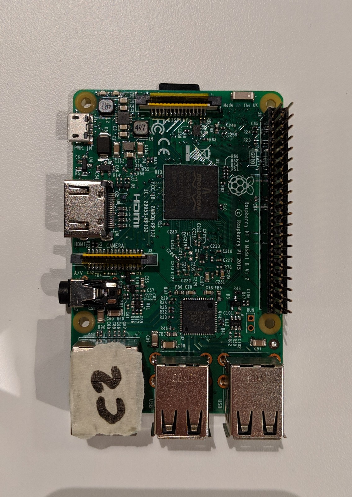

# Smart Compass
## Compass with Geo-Location functions and multi-user positioning 

This project aims to give a simple reliable solution to outdoor navigation. The device uses coordinate points and bearing to guide the user to their destination. 

The device transmits and receives longitude and latitude coordinates using LoRa (long range low power radio). Using received coordinates from other devices an point is drawn to show the position of other devices relative to the user.

***

 

## Demos

The code used for the demos can be found [here](https://gerrit.ericsson.se/#/admin/projects/MontrealGarage/smartCompass)

### With GPS
#### Description
For running the demo with GPS the goal is to set one of the devices with the current location of ericsson, this device stays inside the garage and is the one observed. The second device is taken outside around the building at different positions. This will result in the point on the observed compass changing position. The data will also be displayed on the web interface which shows the gps coordinates of the second device, its distance and bearing from the first devices coordinate points.

#### Operation

 

### Without GPS
#### Description 
For running the demo without the GPS both the devices are placed on a large map of montreal. The devices are given static positions and placed on the map at the position specified. A current coordinate and destination coordinate is chossen for each device. Once the coordinates have been set the sense-hat led screens will display an arrow which points to the choosen destination. The arrow's color will depend on the distance to the destination. The two devices will also communicate their current positions to each other using the LoRa radio. Once the device has received the position of an other device it will draw a white point which points to the other device on the map. 

#### Operation

***
 

## Materials 
2 Raspberry Pis Model 3

2 Sense-hat 

[2 Adafruit Ultimate GPS breakout v3](https://www.adafruit.com/product/746?utmsource=&utmmedium=descrip&utmcampaign=newproductsPiJack&gclid=Cj0KCQjwkoDmBRCcARIsAG3xzl814iM1vEdvGENA6UAuPryqMjKlr7-kQnZGiA7wxJVLssAvxvP_hucaAv5OEALw_wcB)

[2 USB UART Board](https://abra-electronics.com/robotics-embedded-electronics/breakout-boards/communication/wave-122-cp2102-usb-uart-board-type-a.html)

[2 Adafruit RFM 9x LoRa Radios](https://www.adafruit.com/product/3072)

[2 Pi T-Cobbler](https://www.adafruit.com/product/2028)

16 female to female jumper wires 

***

 

## Wiring 

### LoRa 
The LoRa module is connected to the Pi T-Cobbler you can use the jumper wires to make the connections.

The connections are as follows 

|   LoRa    | T-Cobbler|
|---    | --- |
| VIN | 3v3 |
| GND | GND |
| EN | Not used |
| G0 | 

## Setup

